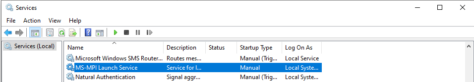

## Running an MPI program on multiple nodes
The `mpiexec` program from MSMPI can be used to launch applications on multiple nodes. There are two ways to launch applications 
on multiple nodes:
1. Using MS-MPI Launch Service:
<<<<<<< HEAD:docs/Run_MSMPI_App.md
<<<<<<< HEAD:docs/Run_MSMPI_App.md
   * Start MS-MPI Launch Service on all the compute nodes using either of the following methods:
      * Run `sc start MSMPILaunchSvc` from a command prompt running with Administriative privileges OR
      * Get the list of services by going to Control Panel-> System and Security -> Administrative Tools -> Services and then start  `MS-MPI Lauch Service` 
      
=======
   * Start MS-MPI Launch Service on all the compute nodes:
      * Run `sc start MSMPILaunchSvc` from a commandline running with Administriative priviledges or
<<<<<<< HEAD:docs/Run_MSMPI_App.md
      * Get the list of services from Control Panel-> System and Security -> Administrative Tools -> Services and then start  `MS-MPI Lauch Service`
<<<<<<< HEAD:docs/Run_MSMPI_App.md
      
>>>>>>> afbf7c1... Update RunningMSMPI.md:docs/RunningMSMPI.md
=======
=======
=======
   * Start MS-MPI Launch Service on all the compute nodes using either of the following methods:
      * Run `sc start MSMPILaunchSvc` from a command prompt running with Administriative privileges OR
>>>>>>> 94ea276... Update RunningMSMPI.md:docs/RunningMSMPI.md
      * Get the list of services by going to Control Panel-> System and Security -> Administrative Tools -> Services and then start  `MS-MPI Lauch Service` 
>>>>>>> 343c7f3... Update RunningMSMPI.md:docs/RunningMSMPI.md
      
>>>>>>> b92ecc1... Update RunningMSMPI.md:docs/RunningMSMPI.md
   * Specify your compute nodes in the `mpiexec` command line (either using `hosts` or `hostfile`), for example: 
      `mpiexec -c 1 -hosts 2 node1 node2 -wdir c:\Tests MPIHelloWorld.exe` 
      The above command runs the `MPIHelloWorld.exe` program on two hosts (`node1` and `node2`) using one core from each node 
2. Using `spmd`:
   * Run `spmd -d` on all compute nodes
      * The `spmd.exe` program is availble after installation of MSMPI (in the folder pointed by the `MSMPI_BIN` variable)
   * Specify your compute nodes in the `mpiexec` command line (either using `hosts` or `hostfile`)
