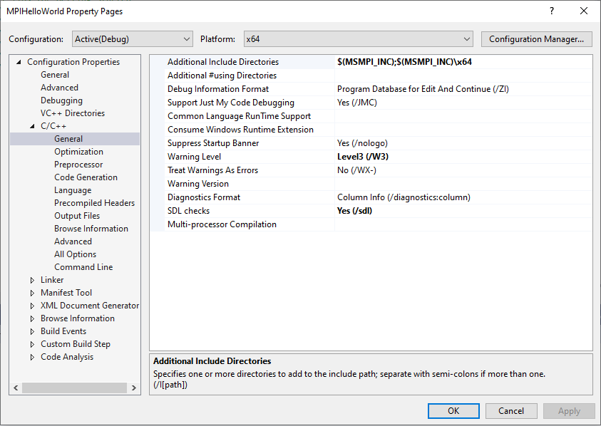
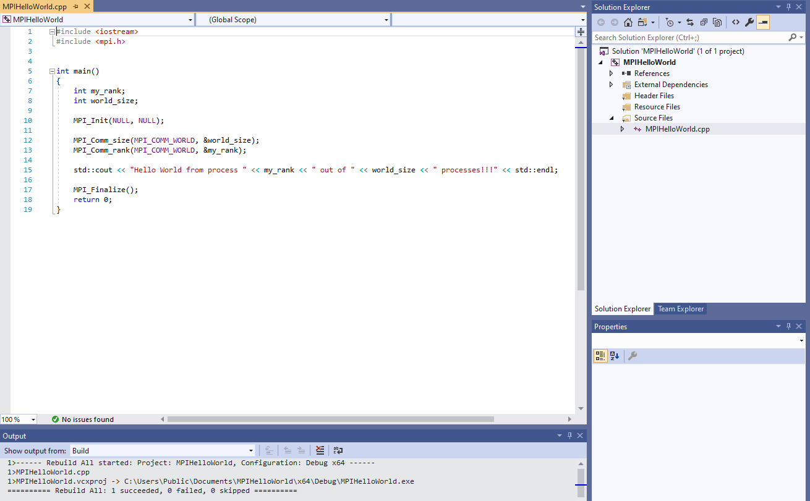
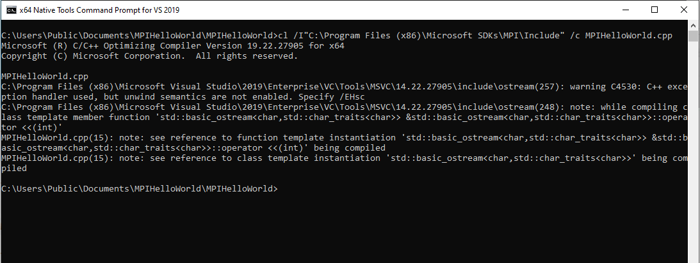

## Compile and run a sample MPI code on Windows
1. Download MS-MPI SDK and Redist installers and install them. The download link can be found on 
our [homepage](https://docs.microsoft.com/en-us/message-passing-interface/microsoft-mpi)
2. After installation, you can verify that the MS-MPI environment variables have been set (you will want to use these environment 
variables in Visual Studio)

3. Open Visual Studio and create a Console App project. Let's name the project `MPIHelloWorld`
4. Use [this](MPIHelloWorld.cpp) code in the newly created project
5. Setup the include directories so that the compiler can find the MS-MPI header files. Note that we will be building 
for 64 bits so we will point the include directory to `$(MSMPI_INC);$(MSMPI_INC)\x64`. If you will be building for 32 bits 
please use `$(MSMPI_INC);$(MSMPI_INC)\x86`

6. Setup the linker options. Add `msmpi.lib` to the Additional Dependencies and also add `$(MSMPI_LIB64)` to the Additional 
Library Directories. Note that we will be building for 64 bits so we will point the Additional Library Directories to $(MSMPI_LIB64). 
If you will be building for 32 bits please use `$(MSMPI_LIB32)`

7. Build the MPIHelloWorld project

8. Test run the program on the command line

Alternatively, you can use the Developer Command Prompt for your version of Visual Studio to compile and link the `MPIHelloWorld.cpp` 
code (replacing steps 3-7 above). To build a 64-bit application, choose x64 Native Tools Command Prompt from the Visual Studio folder 
in the Start menu.

To compile your program into an `.obj` file, go to the folder where `MPIHelloWorld.cpp` exists and run: 
`cl /I"C:\Program Files (x86)\Microsoft SDKs\MPI\Include" /c MPIHelloWorld.cpp`

To create an executable file from the .obj file created in the previous step, run: 
`link /machine:x64 /out:MPIHelloWorld.exe "msmpi.lib" /libpath:"C:\Program Files (x86)\Microsoft SDKs\MPI\Lib\x64" MPIHelloWorld.obj`

You may use `namke` to compile and build the exmaple using the provided [`Makefile`](Makefile) from Developer Command Prompt.
